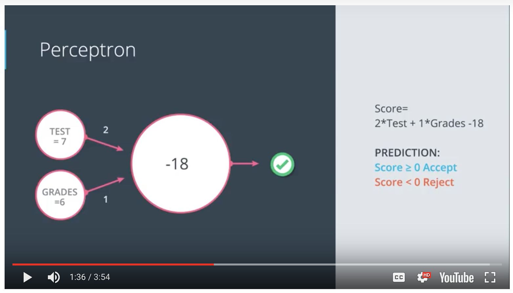

# Neural_Networks

#Nodes layers and edges 

Given some data the neural network draws a line that best seperates the points. 

### Classification problems

student 1
Test 9/10
Grades: 8/10 Y 

student 2
Test 3/10
grades 4/10 N

student 3 
Test: 7/10
Grades: 6/10 ? 

Plot (x,y) x = test y = grades

Look at previous data to make a prediction about new data. 

Question? How to find the line that seperates the data

## Linear boundaries

w1 + x1 + w2 + x2 + b = 0
Wx + b = 0 
W = (w1, w2)
x = (x1, x2)
y = label (either 1 or 0)

Prediction 

y_hat = { 1 if Wx+b >= 0; over the line
        { 0 if Wx+b <= 0: under the line
        
Goal: y_hat needs to ressemble y as close as possible 

### Perceptrons 

Are the building blocks of neural networks. They allow the computer to convert the bounday equation into a useful graph.
We must create a node that consists of data and the boundary line that seperates them. Next, we create input nodes that allow the perceptron to recieve new data, plot the points and check if the points lie in the positve region of the boundary line. 

### Introduction

Neural networks have the ability to allow machines to learn almost in a simliar way as humans. They can be used to perform powerful tasks such as self driving cars, 
