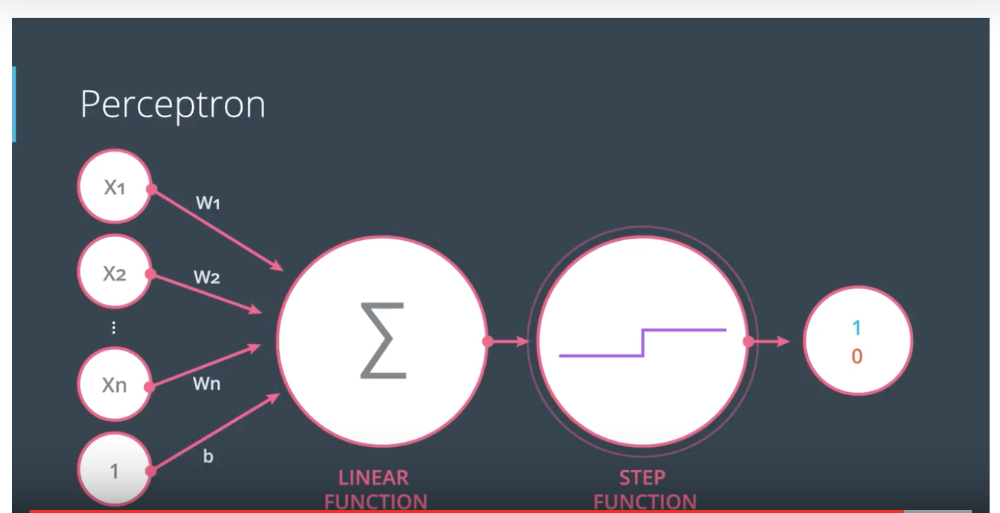

# Neural_Networks

### Introduction

Neural Networks are vaugely modeled after the neurons inside the brain. A neuron recieves information from other neurons and then passes the information along the network to other neurons. 

Artificial Neural networks have the ability to allow machines to learn almost in a simliar way as humans. They can be used to perform powerful tasks such as self driving cars, object recognition, and other intelligent tasks. 

Neural Networks can be modeled using a graph of nodes, layers and edges. The first example featured in this README document is a classification problem. Some times we need a neural network to classify new data based on a model and previous data. In short, given some new data the neural network draws a line that best seperates the points and then calculates some equation with the input and determines whether or not to output yes or no. 

### Classification problems

Some applications require us to classify data based on a set of parameters with the use of an equation. 

Here is an example sourced by udacity.com 

## Design a perceptron to automatically predict if a student will accepted into a college. 
The perceptron will take two inputs, a student's grade and test scores and predict whether or not the student can be admitted into the university. In this example the perceptron has information from the previous two students that were considered for admission.

student 1
Test 9/10
Grades: 8/10 Y 

student 2
Test 3/10
grades 4/10 N

student 3 
Test: 7/10
Grades: 6/10 ? 

Plot (x,y) x = test y = grades

## Linear boundaries

Linear boundaries 

The perceptron can be modeled as follows:

w1x1 + w2x2+...+wnxn + b = 0

wn == weights
b == bias 

This relationship can be easily stored in matrix form 

Wx + b = 0 
W = (w1, w2)
x = (x1, x2)
y = label (either 1 or 0)

Predictions

The prediction basically produces the output that will determine if a point resides under or over the line. 
y_hat = { 1 if Wx+b >= 0; over the line
        { 0 if Wx+b <= 0: under the line
        
Our goal is get y_hat to ressemble y as close as possible 

### Perceptrons 

Are the building blocks of neural networks. They allow the computer to convert the boundary equation into a useful graph.
We must create a node that consists of data and the boundary line that seperates them. Next, we create input nodes that allow the perceptron to recieve new data, plot the points and check if the points lie in the positve region of the boundary line. 

The score is the way that define our criteria for selection. For example:

Consider a case in cyber security monitoring where we have designed a system that checks for one particular anamoly. In this case, our system checks for two criteria. The amount of requests the firewall is taking (n_firewall_Requests) and the performance of the system (sys_health) . A linear equation is created in order to assigned each anomoly a score. 
        Score = 3 * sys_health + 2 * grades - 9
        ## Prediction:
        Score >= 0 Threat
        Score >= 0 Non-threat 
        
Step function 

#### Review 
        

### Logical operators 

AND - follow stardard "and" logic 
OR  -
XOR -

In order to implement perceptrons as logical operators, take the desired truth table (AND, OR, XOR, etc.) use the perceptrons to plot the data and seperate the positive from the negative region. 

### TODO find the weights and bias to create the perceptrons as logical operators. 

There are two ways to go from an AND perceptron to an OR perceptron 

1. Increase the weight 
2. Decrease the magnitude of the bias 

### The perceptron Trick 

Logical operators (using perceptrons) should not be built by the human operator. Instead they should build themselves given some results. 

The following defines the baseline for the perceptron algorithm. 

Given some data a perceptron will find a line and then pick a random linear equation. Next the perceptron will look at how bad the line is doing and move the line around until it gets better. To do this we need to "ask" the points to move the line, either closer or farther, in order to correctly classify them correctly.

## Make a line move closer to a point 

Given some linear equation we define a line: 

nx1 + mx2 - b = 0

Plot the bounday line to get a positive and negative region 

We generalize to a misclassified point 

(x,y)

## Let's discuss a way to make the bounday line come closer to the points. 

## Learning rate Lr

We use a learning rate to allow the line to make small steps towards the point without moving too drastically and potenitally misclassifying other points. 

Multiply learning rate Lr to the misclassified point's coordinates and then perform an operation depending on where the point resides using our equation of a line to give us a new line. 

## The point is misclassifed in the posive region (i.e the point belongs in the negative region) 

We subtract
   n       m     -b
-  x(Lr) y(Lr) 1(Lr)
____________________

New line 
(n-x(Lr))X1 + (m-y(Lr))X2 + (-b - 1(Lr))= 0 

## The point is misclassified in the negative region (i.e the point belongs in the positive region)

We add

   n       m     -b
+  x(Lr) y(Lr) 1(Lr)
____________________

New Line 
(n + x(Lr))X1 + (m + y(Lr))X2 + (-b + 1(Lr))= 0 

Psuedocode: Repeat the following algorithm until we get no errors or we reach a disired number of iterations

1. Start with some random weights and bias W1...Wn, b
2. for every misclassified point (x1,...,xn)
        if the prediction = 0:
                for i= 1...n
                        change weight Wi + Lr(xi)
                        change bias b = Lr
        if the prediction = 1:
                for i= 1...n
                        change weight  Wi - Lr(xi)
                        change basis  b + Lr
                         
                     
### Activation Functions 

Activation functions are used in Neural Networks to determine if the output should be yes or no. More specifically, they can be used to map the resulting value in between 0 to 1 or -1 to 1 depending on the function

There are 2 types of activation functions 

1. Linear
2. Non-linear

Terminology to understand non-linear functions:

Derivative - The slope, the change in y-axis with respect to change in x-axis  

Monotonic function - a function which is either entirely non-increasing or non-decreasing

1. Sigmoid or Logistic Activation Function 

- The cures looks like a S-shape

We use the sigmoid function because it produced ouputs only between 0 to 1.
Since the probabilty of anything exists only between the range of 0 to 1
Sigmoid is used for models where we have to predict the probabilty. 

The Sigmoid function is differentiable, therefore we can find the slope of the 
sigmoid curve at any two points. 

The function is monotonic but its derivative is not. 

2. Softmax function 

- Is an activation function that is equivalent to the sigmoid function but
when the problem has 3 or more classes. 

3. Tanh or hyperbolic tangent 

- is like the logistic sigmoid in the sense that it features an s shaped curve 
but it has a range from -1 to 1.

The main advantage is that the negative inputs will be mapped strongly negative
and the zero inputs will be mapped near zero. 

The function is differentiable and monotonic but its derivative is not.

Mainly used for classification between two classes is used in feed-forward networks

4. ReLU (Rectified Linear Unit) 

- The most used activation function in the world. It is used in almost all the convolutional 
neural networks or deep learning. 

Looking at the graph for the ReLU it is apparent that the function is half rectified
(from bottom). 

f(z) is zero when z is less than zero
f(z) is equal to z when z is above or equal to zero

The function and its derivative are both monotonic

The main issue with this activation function is that all negative values become
zero immediately which decrease the ability of the model to fit or train from the data properly.

In short any negative input given to the ReLU activation function turns the value into zero
immediately in the graph which affects the resulting graph by not mapping the negative values 
appropriately. 

5. Leaky ReLU

- Solves the ReLU problem by featuring a "leak" that helps increase the range of the ReLU function. 
- equation f(y) = a*y where is usually 0.01.

Note When a is not 0.01 then it is called Randomized ReLU

The ReLU and leaky ReLU and their respective derivatives are monotonic. 

### Maximum Likelihood

### Maxmizing Probablities 

### Cross Entropy 

### Multi-class cross entropy 

### Logistic Regression 

### Gradient descent 

### Logistic Regression Algorithm 

### Non-Linear Regions

### Non-Linear Models

### Neural Network Architecture

### Feedforward 

### Backpropagation

 
